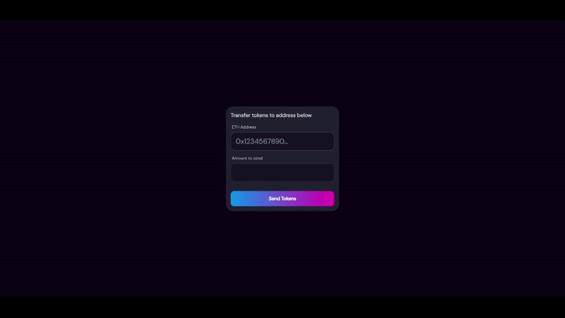
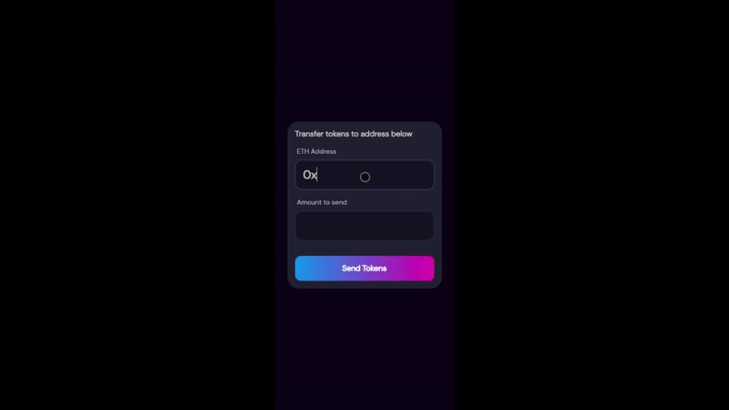

# salad-problem-2

## Problem

Create a transaction form based on the template provided in this folder.

_You may use any third party plugin, library, and/or framework for this problem._

1. You may add input validation/error messages to make the form interactive.
2. Your submission will be rated on its usage intuitiveness and visual attractiveness.
3. Show us your frontend development and design skills.

Please submit your solution using the files provided in the skeletal repo, including any additional files your solution may use.

## Solution

Visit this [link](https://salad-code-challenge.vercel.app/) to try it out yourself!

Tech stack used:

1. React (NextJS)
2. TailwindCSS
3. React Hook Form

Design style inspired by [sushiswap](https://app.sushi.com/swap)
